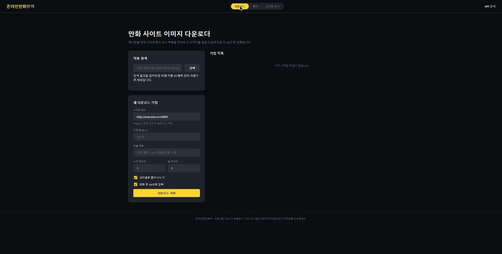
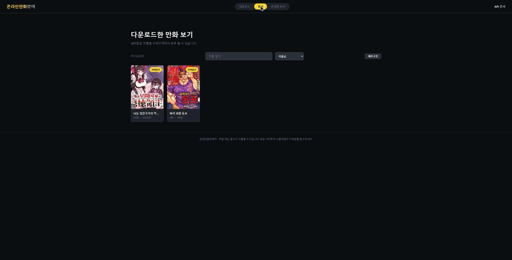
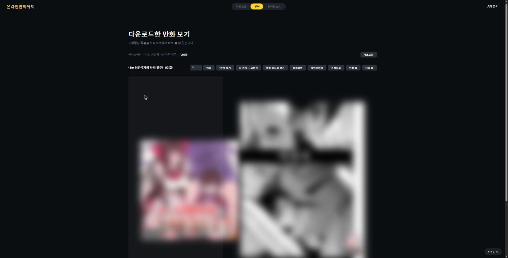
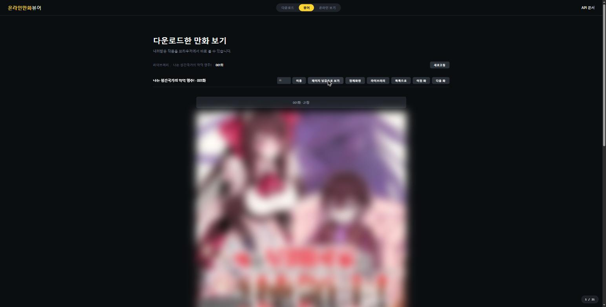
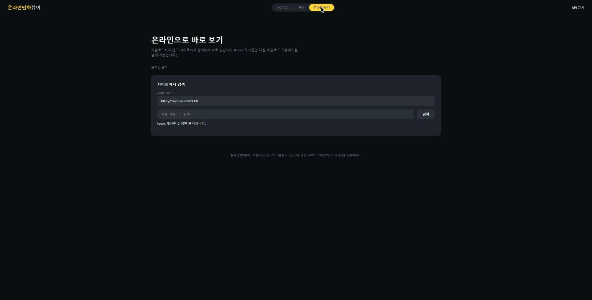

# 온라인만화뷰어

게시판형 만화 사이트에서 작품을 검색·다운로드하고, 받은 파일을 브라우저에서 바로
읽을 수 있는 개인용 FastAPI 웹 앱입니다. 다운로드 없이 사이트에서 바로 검색해서
읽는 온라인 뷰어 탭도 있습니다.

> 개인 소장/백업 목적의 학습용 프로젝트입니다. 대상 사이트의 이용약관과 저작권을
> 반드시 확인하고 준수한 상태에서 사용하세요.

## 기능

- **다운로드** — 사이트에서 작품을 검색해 작품 ID를 자동으로 채우고, 페이지
  범위를 지정해 회차 이미지를 일괄 다운로드·zip 압축. 여러 작업을 큐에 넣고
  진행 상황(회차 수, 다운로드/실패 이미지 수, 로그)을 실시간으로 확인.
- **뷰어** — 다운로드한 작품을 브라우저에서 바로 읽기. 검색·정렬, 이어보기·읽음
  표시, 웹툰(세로 연속 스크롤) 모드와 페이지 넘김(1·2쪽, 읽는 방향) 모드,
  전체화면, 쪽 이동, 키보드 단축키 지원.
- **온라인 보기** — 다운로드 없이 사이트에서 바로 검색 → 회차 목록 → 읽기.
  다운로드 파이프라인과는 완전히 분리된 별개 기능이며 서버에 아무 파일도
  남기지 않습니다.

## 빠른 시작

```bash
pip install -r requirements.txt
python -m uvicorn app.main:app --reload
```

브라우저에서 `http://127.0.0.1:8000` 접속. API 문서는 `/docs`.

## 스크린샷

| 다운로드 | 뷰어(라이브러리) |
|---|---|
|  |  |

| 뷰어 - 페이지 넘김 모드 | 뷰어 - 웹툰(세로 스크롤) 모드 |
|---|---|
|  |  |

| 온라인 바로 보기 |
|---|
|  |

> 뷰어 스크린샷은 실제로 표시되는 만화 페이지 내용을 모자이크 처리했습니다.
> 다운로드/온라인 보기 화면의 사이트 주소 입력창도 예시 값으로 가렸습니다.

## 구조

```
app/            FastAPI 백엔드 (크롤러, 작업 큐, 뷰어/온라인 API)
static/         프런트엔드 (바닐라 JS SPA, 프레임워크 없음)
assets/         README용 스크린샷 등 정적 리소스
```

## 제한사항

- 특정 게시판 CMS 구조(`/bbs/board.php?bo_table=toons`)를 전제로 만들어졌습니다 —
  범용 크롤러가 아닙니다.
- 검색 기능은 대상 사이트의 비공식 내부 API에 의존하므로, 사이트 구조가 바뀌면
  예고 없이 깨질 수 있습니다.
- 인증/접근 제어가 없는 개인용 로컬 도구입니다. 외부에 노출된 네트워크에
  그대로 띄우지 마세요.

## 라이선스

개인 학습용 프로젝트로, 별도 라이선스를 지정하지 않았습니다.
